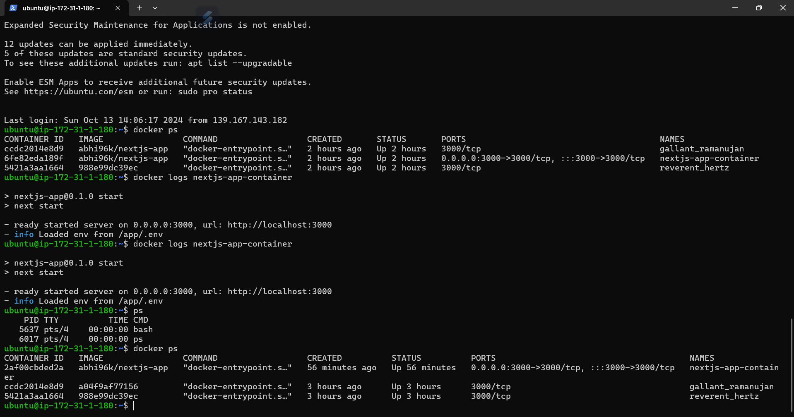
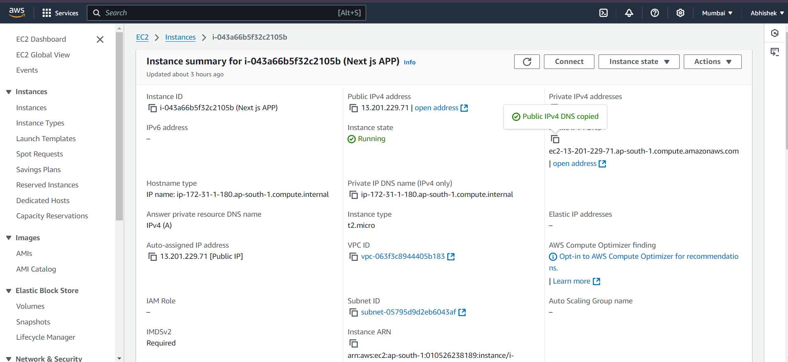
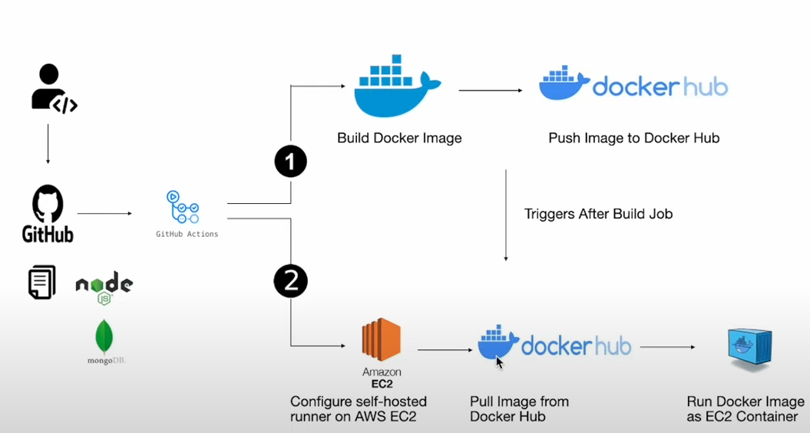

---
runme:
  id: 01JA3776FJ88FQN81TNTWZBXXS
  version: v3
---

This is a [Next.js](https://nextjs.org/) project bootstrapped with [`create-next-app`](https://github.com/vercel/next.js/tree/canary/packages/create-next-app).

## Getting Started

First, run the development server:

```bash {"id":"01JA3776FJ88FQN81TNQAF0SGE"}
npm run dev
# or
yarn dev
# or
pnpm dev

```

Open [http://localhost:3000](http://localhost:3000) with your browser to see the result.

You can start editing the page by modifying `app/page.js`. The page auto-updates as you edit the file.

This project uses [`next/font`](https://nextjs.org/docs/basic-features/font-optimization) to automatically optimize and load Inter, a custom Google Font.

## Learn More

To learn more about Next.js, take a look at the following resources:

- [Next.js Documentation](https://nextjs.org/docs) - learn about Next.js features and API.
- [Learn Next.js](https://nextjs.org/learn) - an interactive Next.js tutorial.

You can check out [the Next.js GitHub repository](https://github.com/vercel/next.js/) - your feedback and contributions are welcome!

## Deploy on Vercel

The easiest way to deploy your Next.js app is to use the [Vercel Platform](https://vercel.com/new?utm_medium=default-template&filter=next.js&utm_source=create-next-app&utm_campaign=create-next-app-readme) from the creators of Next.js.

Check out our [Next.js deployment documentation](https://nextjs.org/docs/deployment) for more details.





Here is a detailed description of each step in the provided diagram for creating a workflow using GitHub Actions, Docker Hub, and AWS EC2:

1. **Code and Build Process**

- **Developer Pushes Code to GitHub**: The process begins when a developer writes code (likely a Node.js and MongoDB-based project) and pushes the changes to a GitHub repository.
- **GitHub Actions Trigger**: GitHub Actions is configured to automatically run a workflow when the repository is updated. This workflow could include steps to build the Docker image for the application.
- **Build Docker Image**: GitHub Actions initiates the process of building a Docker image for the project. A Dockerfile would be used to define the application's environment, libraries, and dependencies.

2. **Docker Hub Integration**

- **Push Docker Image to Docker Hub**: After successfully building the Docker image, GitHub Actions pushes the built image to Docker Hub, a repository for storing Docker images. The Docker image will be used later for deployment.
- **Trigger Post-Build Actions**: After pushing the image to Docker Hub, a post-build action is triggered. This action could notify the self-hosted runner (on AWS EC2) to pull the image for deployment.

3. **Deployment on AWS EC2**

- **Configure Self-Hosted Runner on AWS EC2**: A self-hosted runner is configured on an Amazon EC2 instance, which is responsible for handling deployments. The runner is integrated with GitHub Actions to listen for new builds or updates.
- **Pull Docker Image from Docker Hub**: The self-hosted runner pulls the newly built Docker image from Docker Hub.
- **Run Docker Image as EC2 Container**: The Docker image is executed within a Docker container on the EC2 instance, effectively running the application. The container could be orchestrated to handle scaling, load balancing, and other tasks.

This entire process automates the build, push, and deployment workflow for a Node.js and MongoDB-based application using GitHub Actions, Docker Hub, and AWS EC2.

Let me know if you'd like further details or adjustments for your earse.io diagram!




